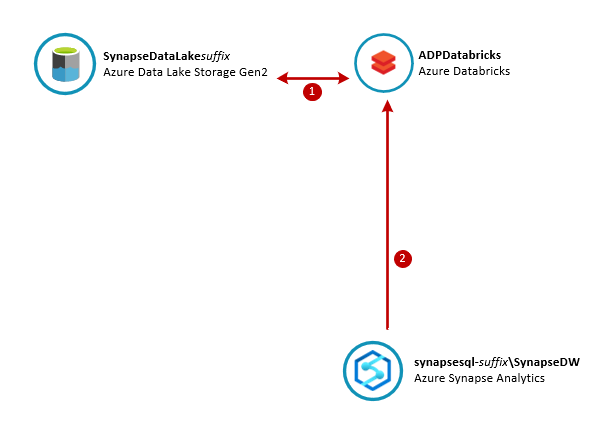
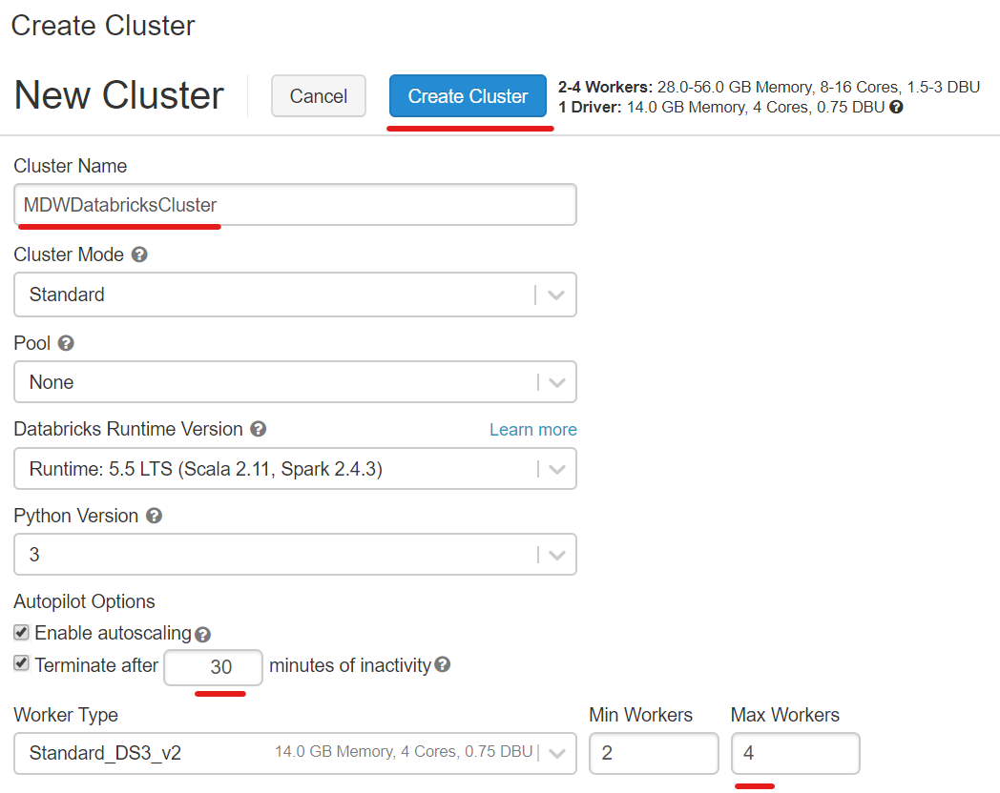
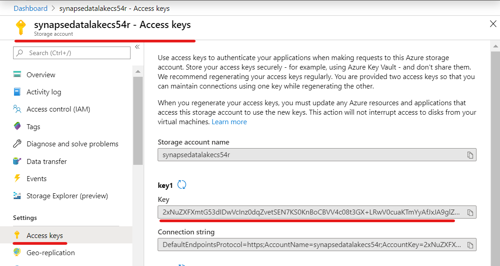
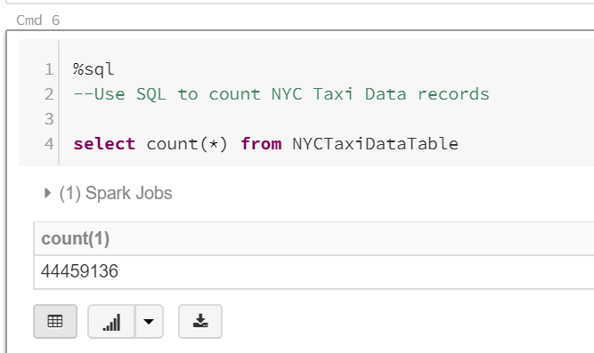
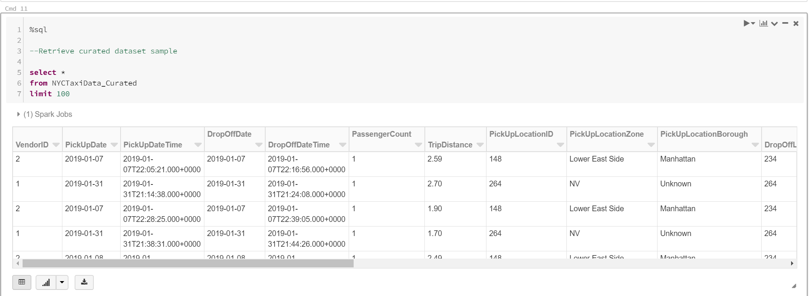
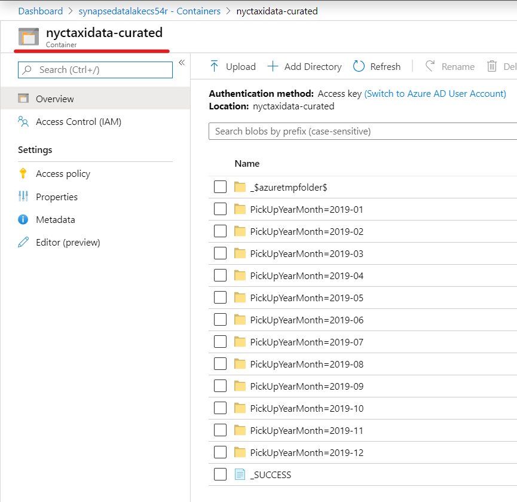
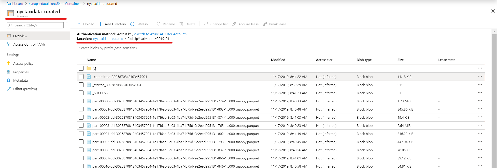

# Lab 3: Explore Big Data using Azure Databricks
In this lab you will use Azure Databricks to explore the New York Taxi data files you saved in your data lake in Lab 2. Using a Databricks notebook you will connect to the data lake and query taxi ride details. 

The estimated time to complete this lab is: **45 minutes**.

## Microsoft Learn & Technical Documentation

The following Azure services will be used in this lab. If you need further training resources or access to technical documentation please find in the table below links to Microsoft Learn and to each service's Technical Documentation.

Azure Service | Microsoft Learn | Technical Documentation|
--------------|-----------------|------------------------|
Azure Databricks | [Perform data engineering with Azure Databricks](https://docs.microsoft.com/en-us/learn/paths/data-engineering-with-databricks/) | [Azure Databricks Technical Documentation](https://docs.microsoft.com/en-us/azure/azure-databricks/)
Azure Data Lake Gen2 | [Large Scale Data Processing with Azure Data Lake Storage Gen2](https://docs.microsoft.com/en-us/learn/paths/data-processing-with-azure-adls/) | [Azure Data Lake Gen2 Technical Documentation](https://docs.microsoft.com/en-us/azure/storage/blobs/data-lake-storage-introduction)
Azure Synapse Analytics | [Implement a Data Warehouse with Azure Synapse Analytics](https://docs.microsoft.com/en-us/learn/paths/implement-sql-data-warehouse/) | [Azure Synapse Analytics Technical Documentation](https://docs.microsoft.com/en-us/azure/sql-data-warehouse/)

## Lab Architecture


Step     | Description
-------- | -----
 |Build an Azure Databricks notebook to explore the data files you saved in your data lake in the previous exercise. You will use Python and SQL commands to open a connection to your data lake and query data from data files.
 |Integrate datasets from Azure Synapse Analytics data warehouse to your big data processing pipeline. Databricks becomes the bridge between your relational and non-relational data stores.


**IMPORTANT**: Some of the Azure services provisioned require globally unique name and a “-suffix” has been added to their names to ensure this uniqueness. Please take note of the suffix generated as you will need it for the following resources in this lab:

Name	                     |Type
-----------------------------|--------------------
synapsedatalake*suffix*	         |Storage Account
ADPDatabricks-*suffix*	     |Databricks Workspace
synapsesql-*suffix* |SQL server

**IMPORTANT**: The code snippets below illustrate the simplest and quickest way to establish connections between Databricks and other Azure services. They **ARE NOT** considered best practices as they expose secrets and passwords in plain text. For a secure implementation following the security best practices, please consider the use of Azure Key Vault in conjuntion with Databricks Secret Scopes (<https://docs.azuredatabricks.net/user-guide/secrets/secret-scopes.html>).

## Create Azure Databricks Cluster 
In this section you are going to create an Azure Databricks cluster that will be used to execute notebooks.

**IMPORTANT**|
-------------|
**Execute these steps on your host computer**|

1.	In the Azure Portal, navigate to the lab resource group and locate the Azure Databricks resource ADPDatabricks-*suffix*.

2.	On the **ADPDatabricks-*suffix*** blade, click the **Launch Workspace** button. The Azure Databricks portal will open on a new browser tab.

    

3.	On the Azure Databricks portal, click the **Clusters** button on the left-hand side menu. 

4.	On the **Clusters** blade, click **+ Create Cluster**.

    

5.	On the **Create Cluster** blade, enter the following connection details:
    <br>- **Cluster Name**: ADPDatabricksCluster
    <br>- **Terminate after**: 30 minutes
    <br>- **Min Workers**: 1
    <br>- **Max Workers**: 2

    Leave all other fields with their default values.

6.	Click **Create Cluster**. It should take around 5 to 7 minutes for the cluster to be fully operational.

    

## Create an Azure Databricks Notebook 
In this section you are going to create an Azure Databricks notebook that will be used to explore the taxi data files you copied to your data lake in the Lab 2. 

**IMPORTANT**|
-------------|
**Execute these steps on your host computer**|

1.	On the Azure Databricks portal, click the **Home** button on the left-hand side menu. 

2.	On the **Workspace** blade, click the down arrow next to your user name and then click **Create > Notebook**.

    

3.	On the **Create Notebook** pop-up window type “NYCTaxiData” in the Name field.

4.	Ensure you have the **Language** field set to **Python** and the **Cluster** field is set to **ADPDatabricksCluster**.

5.	Click **Create**.

    

6.	On the **Cmd 1** cell, you will invoke the Spark API to establish a connection to your SynapseDataLake storage account. For this you will need to retrieve the name and the key of your SynapseDataLake storage account from the Azure Portal. 

    

7.	Use the Python code below and replace *synapsedatalake[suffix]* with your own suffix on line 22 and to replace *[your synapsedatalake account key]* with the data lake account key on line 23.

    

```python
#Setup connection to SynapseDataLake storage account

def MountDataLakeContainer(datalakeAccountName, datalakeAccountKey, containerName, mountPointName):
    dataLakeAccountDNS = datalakeAccountName + ".blob.core.windows.net"
    
    dataLakeAuthTypeConfig = "fs.azure.account.auth.type." + dataLakeAccountDNS
    dataLakeKeyConfig = "fs.azure.account.key." + dataLakeAccountDNS
    
    dataLakeExtraConfig = {dataLakeAuthTypeConfig:"SharedKey"
                           , dataLakeKeyConfig:datalakeAccountKey}
    
    containerUri = "wasbs://" + containerName + "@" + dataLakeAccountDNS
    mountPointFolder = "/mnt/" + mountPointName

    try:
        dbutils.fs.mount(source = containerUri, mount_point = mountPointFolder, extra_configs = dataLakeExtraConfig)
    except Exception as e:
        if "Directory already mounted" in str(e):
            pass # Ignore error if already mounted.
        else:
            raise e
    return containerUri

#Set Account Name and Key Variable Values
dataLakeAccountName = 'synapsedatalake[suffix]' #<-- Your synapsedatalake account name goes here. Remember to replace <suffix> with your own suffix.
dataLakeAccountKey = '[your synapsedatalake account key]' #<-- Your synapsedatalake account key goes here.

#Mount NYCTaxiData-Raw and NYCTaxiData-Curated Containers
MountDataLakeContainer(dataLakeAccountName, dataLakeAccountKey, 'nyctaxidata-raw', 'raw')
MountDataLakeContainer(dataLakeAccountName, dataLakeAccountKey, 'nyctaxidata-curated', 'curated')
```
8.	Press **Shift + Enter** to execute and create a new notebook cell. 

9.	In the **Cmd 2** cell, define a new **StructType** object that will contain the definition of the data frame schema.

10.	Using the schema defined in the previous step, initialise a new data frame by invoking the Spark API to read the contents of the nyctaxidata-raw container in the SynapseDataLake storage account. Use the Python code below:

```python
#Define NYCTaxiData schema and load data into a Data Frame

from pyspark.sql.types import *

nycTaxiDataSchema = StructType([
  StructField("VendorID",IntegerType(),True)
  , StructField("tpep_pickup_datetime",DateType(),True)
  , StructField("tpep_dropoff_datetime",DateType(),True)
  , StructField("passenger_count",IntegerType(),True)
  , StructField("trip_distance",DoubleType(),True)
  , StructField("RatecodeID",IntegerType(),True)
  , StructField("store_and_fwd_flag",StringType(),True)
  , StructField("PULocationID",IntegerType(),True)
  , StructField("DOLocationID",IntegerType(),True)
  , StructField("payment_type",IntegerType(),True)
  , StructField("fare_amount",DoubleType(),True)
  , StructField("extra",DoubleType(),True)
  , StructField("mta_tax",DoubleType(),True)
  , StructField("tip_amount",DoubleType(),True)
  , StructField("tolls_amount",DoubleType(),True)
  , StructField("improvement_surcharge",DoubleType(),True)
  , StructField("total_amount",DoubleType(),True)])
  
dfNYCTaxiData = spark.read.format('csv').options(header='true').schema(nycTaxiDataSchema).load('/mnt/raw/*.csv')
dfNYCTaxiData.cache()
```

11.	Hit **Shift + Enter** to execute the command and create a new cell. 

12.	In the **Cmd 3** cell, call the display function to show the contents of the data frame dfNYCTaxiData. Use the Python code below:

```python
#Display Data Frame Content

display(dfNYCTaxiData)
```
13.	Hit **Shift + Enter** to execute the command and create a new cell. You will see a data grid showing the top 1000 records from the dataframe:

    

14.	In the **Cmd 4** cell, call the **select()** method of the data frame object to select the columns "tpep_pickup_datetime", "passenger_count" and "total_amount". Then use the  **filter()** method to filter rows where "passenger_count > 6" and "total_amount > 50.0". Use the Python code below:

```python
# Use Data Frame API Operations to Filter Data

display(dfNYCTaxiData.select("tpep_pickup_datetime", "passenger_count", "total_amount").filter("passenger_count > 6 and total_amount > 50.0"))
```

15.	Hit **Shift + Enter** to execute the command and create a new cell. 

    

16.	In the **Cmd 5** cell, call the **createOrReplaceTempView** method of the data frame object to create a temporary view of the data in memory. Use the Python code below:

```python
# Create Local Temp View

dfNYCTaxiData.createOrReplaceTempView('NYCTaxiDataTable')
```
17.	Hit **Shift + Enter** to execute the command and create a new cell. 

18.	In the **Cmd 6** cell, change the cell language to SQL using the *%sql* command. 

19.	Write a SQL query to retrieve the total number of records in the NYCTaxiDataTable view. Use the command below:

```sql
%sql
--Use SQL to count NYC Taxi Data records

select count(*) from NYCTaxiDataTable
```

20.	Hit **Shift + Enter** to execute the command and create a new cell. You will see the total number of records in the data frame at the bottom of the cell.

    

21.	In the **Cmd 7** cell, write a SQL query to filter taxi rides that happened on the Apr, 7th 2019 that had more than 5 passengers. Use the command below:

```sql
%sql
-- Use SQL to filter NYC Taxi Data records

select cast(tpep_pickup_datetime as date) as pickup_date
  , tpep_dropoff_datetime
  , passenger_count
  , total_amount
from NYCTaxiDataTable
where cast(tpep_pickup_datetime as date) = '2019-04-07'
  and passenger_count > 5
```

22.	Hit **Shift + Enter** to execute the command and create a new cell. You will see a grid showing the filtered result set.

    

23.	In the **Cmd 8** cell, write a SQL query to aggregate records and return total number of rides by payment type. Use the command below:

```sql
%sql
-- Use SQL to aggregate NYC Taxi Data records and visualize data
select case payment_type
            when 1 then 'Credit card'
            when 2 then 'Cash'
            when 3 then 'No charge'
            when 4 then 'Dispute'
            when 5 then 'Unknown'
            when 6 then 'Voided trip'
        end as PaymentType
  , count(*) as TotalRideCount
from NYCTaxiDataTable
group by payment_type
order by TotalRideCount desc

```

24.	Hit **Shift + Enter** to execute the command and create a new cell. Results will be displayed in a grid in the cell.

25.	Click the **Bar chart** button to see results as a bar chart.

    
    


26. Using Python, open a JDBC connection to your Azure Synapse Analytics and load Taxi location lookup data from the Staging.NYCTaxiLocationLookup table into a new data frame called dfLocationLookup. 

    **IMPORTANT**: Don't forget to replace the 'synapsesql-*suffix*' with your specific Azure Synapse Analytics server name.

    In the same cell, create a temporary view called "NYCTaxiLocation" and display the contents of the data frame. Use the Python code below:

```python
# Load Taxi Location Data from Azure Synapse Analytics

jdbcUrl = "jdbc:sqlserver://synapsesql-suffix.database.windows.net:1433;database=SynapseDW" #Replace "suffix" with your own  
connectionProperties = {
  "user" : "adpadmin",
  "password" : "P@ssw0rd123!",
  "driver" : "com.microsoft.sqlserver.jdbc.SQLServerDriver"
}

pushdown_query = '(select * from NYC.TaxiLocationLookup) as t'
dfLookupLocation = spark.read.jdbc(url=jdbcUrl, table=pushdown_query, properties=connectionProperties)

dfLookupLocation.createOrReplaceTempView('NYCTaxiLocation')

display(dfLookupLocation) 

```

27. Hit **Shift + Enter** to execute the command and create a new cell. Results will be displayed in a grid in the cell.

    

28. In the **Cmd 10** cell, write a SQL query to cleanse data and apply standard column definitions. You should joining the two dataframes using their view names and filter out any invalid data. The resulting dataset should be saved in a Spark table using Parquet files sitting in the NYCTaxiData-Curated container in your SynapseDataLake storage account. Use the SQL command below:

```sql
%sql
--Create Spark table with cleansed, validated dataset combining raw CSV files and reference data from you Synapse data warehouse
--Data will be saved into the NYCTaxiData-Curated container in your SynapseDataLake account

create table if not exists NYCTaxiData_Curated
using parquet partitioned by (PickUpYearMonth) --Use Parquet format partitioned by YYYY-MM
options ('compression'='snappy') --Parquet compression options
location '/mnt/curated/' --Data to be saved in the NYCTaxiData-Curated container in your SynapseDataLake storage account.
as
select 
    VendorID
    , cast(tpep_pickup_datetime as date) as PickUpDate
    , concat(year(tpep_pickup_datetime), '-', format_string('%02d',month(tpep_pickup_datetime),'##')) as PickUpYearMonth --Partition Key
    , cast(tpep_pickup_datetime as timestamp) as PickUpDateTime
    , cast(tpep_dropoff_datetime as date) as DropOffDate
    , cast(tpep_dropoff_datetime as timestamp) as DropOffDateTime
    , passenger_count as PassengerCount
    , trip_distance as TripDistance
    , cast(PULocationID as int) as PickUpLocationID
    , pu.Zone as PickUpLocationZone
    , pu.Borough as PickUpLocationBorough
    , cast(DOLocationID as int) as DropOffLocationID
    , do.Zone as DropOffLocationZone
    , do.Borough as DropOffLocationBorough
    , cast(payment_type as int) as PaymentTypeID
    , case payment_type
            when 1 then 'Credit card'
            when 2 then 'Cash'
            when 3 then 'No charge'
            when 4 then 'Dispute'
            when 5 then 'Unknown'
            when 6 then 'Voided trip'
        end as PaymentTypeDescription
    , cast(case when fare_amount < 0 then 0.00 else fare_amount end as decimal(8,2)) as FareAmount --Cleanse invalid data
    , cast(case when extra < 0 then 0.00 else extra end as decimal(8,2)) as ExtraAmount --Cleanse invalid data
    , cast(case when mta_tax < 0 then 0.00 else mta_tax end as decimal(8,2)) as MTATaxAmount --Cleanse invalid data
    , cast(case when tip_amount < 0 then 0.00 else tip_amount end as decimal(8,2)) as TipAmount --Cleanse invalid data
    , cast(case when tolls_amount < 0 then 0.00 else tolls_amount end as decimal(8,2)) as TollsAmount --Cleanse invalid data
    , cast(case when improvement_surcharge < 0 then 0.00 else improvement_surcharge end as decimal(8,2)) as ImprovementSurchargeAmount --Cleanse invalid data
    , cast(case when total_amount < 0 then 0.00 else total_amount end as decimal(8,2)) as TotalRideAmount --Cleanse invalid data
from NYCTaxiDataTable as rides
  join NYCTaxiLocation as pu
    on rides.PULocationID = pu.LocationID
  join NYCTaxiLocation as do
    on rides.DOLocationID = do.LocationID
where passenger_count > 0 --Data Cleanup Rules
  and year(tpep_pickup_datetime) = 2019
```

39. Hit **Shift + Enter** to execute the command. Results will be displayed in a grid in the cell.

40. In the **Cmd 11** cell, write a SQL query to retrieve the first 100 rows from the Spark table NYCTaxiData_Curated you just created in the previous step. Use the SQL command below.

```sql
%sql

--Retrieve curated dataset sample

select *
from NYCTaxiData_Curated
limit 100
```


## Review the NYCTaxiData-Curated Container Content
In this section you are going to review the content of the NYCTaxiData-Curated container in your SynapseDataLake storage account after you created the Spark table using the Databricks notebook in the previous exercise. You should see a list of folders created, one for each partition and inside them the collection of Parquet files containing cleansed and validated taxi data ready to be used for reporting.


**IMPORTANT**|
-------------|
**Execute these steps on your host computer**|

1.	In the Azure Portal, go to the lab resource group and locate the Azure Storage account **synapsedatalake*suffix***. 
2.	On the **Overview** panel, click **Containers**.

    

3. Open the NYCTaxiData-Curated container to see its contents. You should see a folder structure similar to this one:

    

4. Inside each folder you will find the collection of individual Parquet files that make up the NYCTaxiData_Curated Spark table.

    
